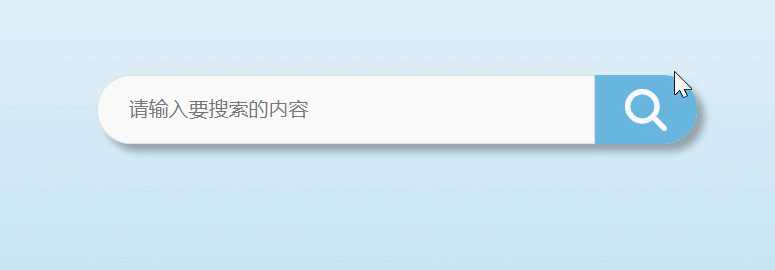
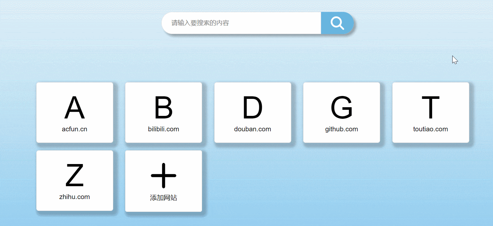
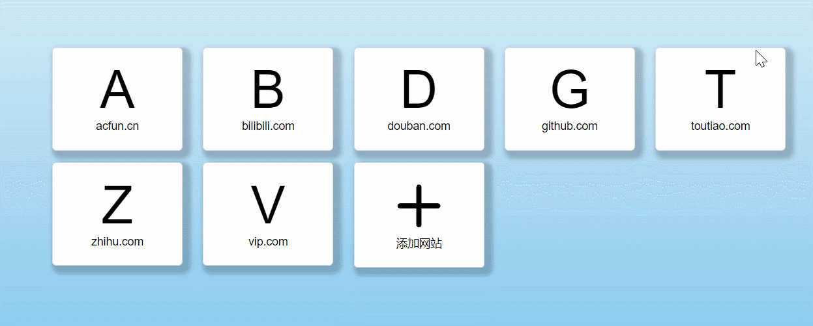
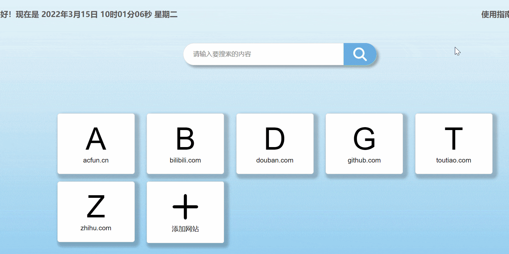
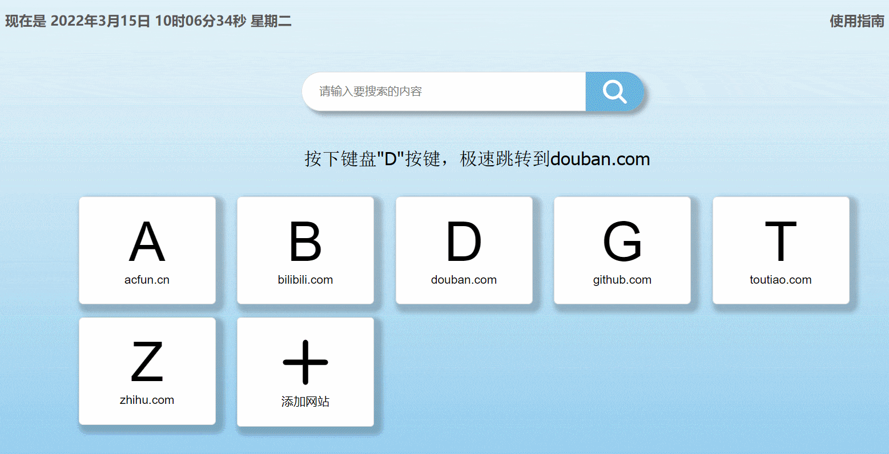

# 时光导航：一个简约的个性化导航

***

## 预览链接： [GitHub](https://xulei1998.github.io/time-nav/index.html)           [Gitee](https://xulei1998.gitee.io/time-nav/index.html)

## 使用指南

### 1.搜索

在搜索框内输入您想要搜索的内容，按**回车**或右边**搜索按钮**进行搜索。

### 2.访问网站

通过鼠标点击页面上已有的导航框来访问网站。

### 3.删除导航框

鼠标**移入**导航框，导航框右上角会浮现一个“×”删除按钮，点击可以删除此导航框。

### 4.添加导航框

鼠标点击“+”添加网站导航框，输入您常用的网站的网址来定制个性化的导航。

### 5.快捷键——极速跳转

**键盘**按下已有导航框内**大写首字母**，即可快速跳转到该常用网站。

